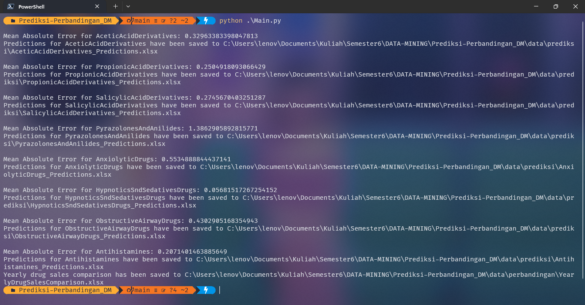

<p align="center">
  <a href="#tujuan">Tujuan</a> •
  <a href="#struktur-project">Struktur Proejct</a> •
  <a href="#data-yang-digunakan">Data yang Digunakan</a> •
  <a href="#hasil-khir">Hasil Akhir</a> •
  <a href="#penggunaan">Penggunaan</a> •
  <a href="#deskripsi-progam">Deskripsi Progam</a>
</p>
<h1 align="center">
  <br>
  <a href=""></a>
  <br>
  DATA MINGING
  <br>
</h1>

<h4>Repository ini dibuat sebagai bagian dari tugas mata kuliah Data Mining. Tujuannya adalah untuk memprediksi penjualan berbagai kategori obat menggunakan model regresi linier. Selain itu, Repository ini juga melakukan analisis dan perbandingan penjualan obat berdasarkan tahun. Data yang digunakan adalah data penjualan obat yang disimpan dalam file Excel.</h4>

<p align="center">
  <a href="https://www.instagram.com/dhf.ai/">
    DHIA DHAIFULLAH
  </a>
  -
  <a href="https://www.instagram.com/ariika.al/">
    ARIKAL KHAIRAT
  </a>
  -
  <a href="https://www.instagram.com/thereezah/">
      CHALIDAH AZ-ZAHRAH H
  </a>
</p>




## Tujuan
* **Prediksi Penjualan** 
    - Memperkirakan penjualan obat di masa depan berdasarkan data historis.
* **Analisis Tren**
    - Mengidentifikasi tren penjualan obat per tahun.
* **Perbandingan Penjualan**
    - Membandingkan penjualan obat antara berbagai kategori dan tahun untuk melihat kategori mana yang paling populer atau paling laku.

## Struktur Project
Proyek ini terdiri dari beberapa langkah utama:
1. **Membaca dan Memanipulasi Data**: Mengimpor data dari file Excel dan memprosesnya untuk memastikan data dalam format yang benar.
2. **Rekayasa Fitur**: Membuat fitur tambahan seperti lag untuk membantu dalam prediksi.
3. **Pelatihan Model**: Menggunakan model regresi linier untuk memprediksi penjualan obat.
4. **Evaluasi Model**: Mengukur kinerja model menggunakan Mean Absolute Error (MAE).
5. **Penyimpanan Hasil Prediksi**: Menyimpan hasil prediksi ke dalam file Excel.
6. **Analisis Penjualan Tahunan**: Mengelompokkan dan menganalisis data penjualan berdasarkan tahun dan kategori obat.
7. **Penyimpanan Data Analisis**: Menyimpan hasil analisis penjualan tahunan ke dalam file Excel.


## Data yang Digunakan
Data yang digunakan dalam proyek ini adalah data penjualan obat dari file Excel yang berisi kolom:
- `Time`: Waktu penjualan dalam format datetime.
- Kolom lainnya yang mewakili berbagai kategori obat dengan nilai penjualan masing-masing.

## Hasil Akhir
1. **Prediksi Penjualan Obat**: File Excel yang berisi hasil prediksi penjualan untuk setiap kategori obat.
2. **Perbandingan Penjualan Tahunan**: File Excel yang berisi perbandingan penjualan obat per tahun dan peringkat penjualan obat untuk setiap tahun.

## File yang Dihasilkan
- `prediksi/`: Folder yang berisi file prediksi penjualan untuk setiap kategori obat.
- `perbandingan/YearlyDrugSalesComparison.xlsx`: File yang berisi perbandingan penjualan tahunan.


## Penggunaan
Untuk mengkloning dan menjalankan aplikasi ini, Anda memerlukan [Git](https://git-scm.com) dan [Python](https://www.python.org/downloads/) (yang dilengkapi dengan [pip](https://pip.pypa.io/en/stable/installing/)) diinstal di komputer Anda. Dari baris perintah Anda:

```bash
# Klone repository ini
$ git clone https://github.com/ddhaifullah/Prediksi-Perbandingan_DM

# Masuk ke direktori repository
$ cd Prediksi-Perbandingan_DM

# Install dependencies
$ pip install -r requirements.txt

# Jalankan program
$ python .\Script.py
```

> **Note**
> Jika Anda menggunakan Linux, Anda mungkin perlu menjalankan perintah sebagai `sudo`. atau jalankan perintah `python3` jika `python` tidak berfungsi.


## Deskripsi Progam

Ini adalah program sederhana yang saya buat untuk memenuhi tugas mata kuliah Data Mining. Saya menggunakan beberapa referensi dan sumber daya online untuk membantu saya memahami konsep dan teknik yang diperlukan. Berikut adalah beberapa sumber daya yang saya gunakan:

- [Pandas Documentation](https://pandas.pydata.org/docs/)
- [Scikit-learn Documentation](https://scikit-learn.org/stable/documentation.html)
- [Sklearn Tutorial](https://www.datacamp.com/community/tutorials/sklearn-tutorial-base)

